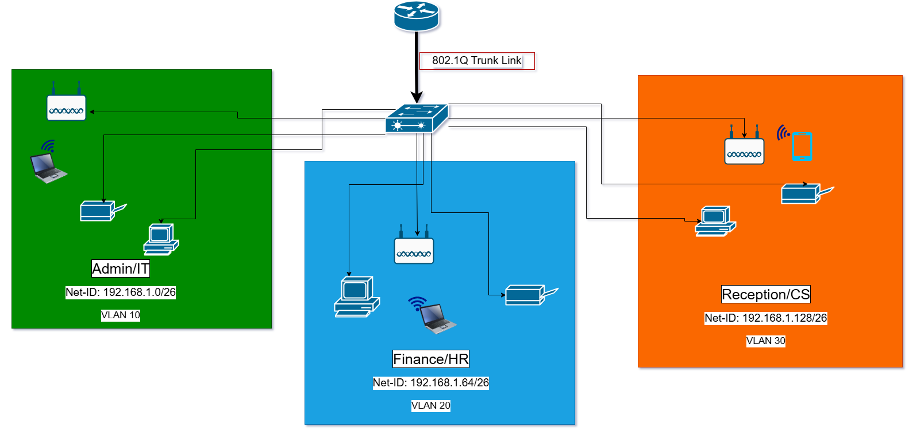
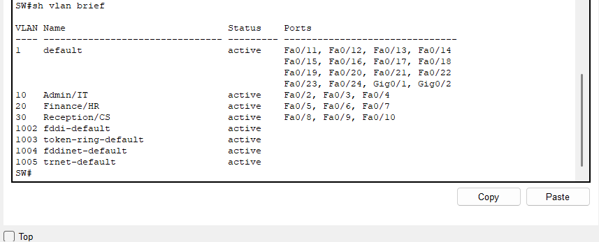
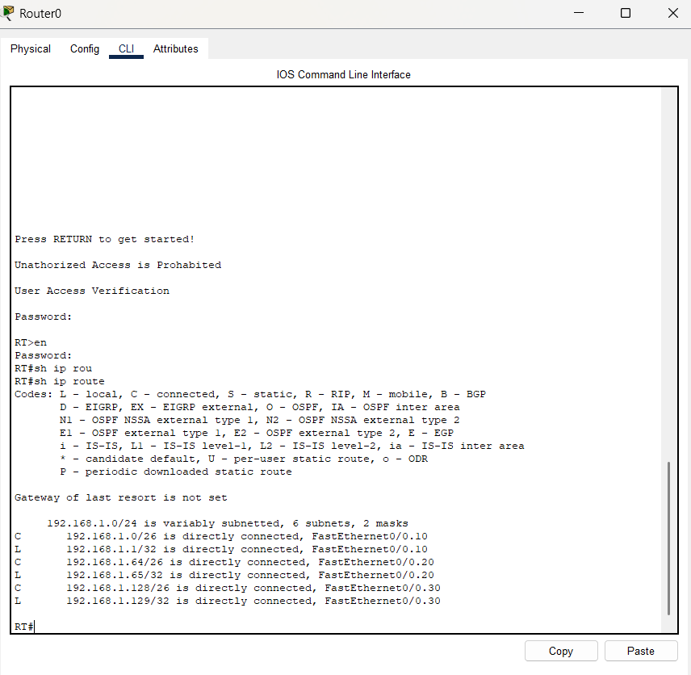
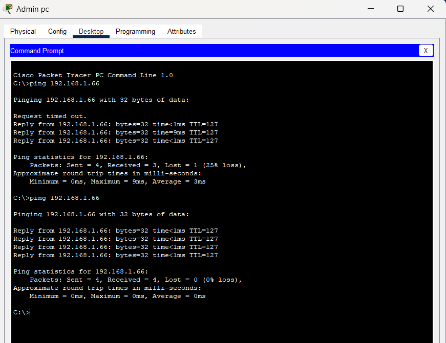

# XYZ Company Branch Network Design 🌐

### Project Overview
Designed and simulated a multi-VLAN network architecture for a new branch office using Cisco Packet Tracer. The project required segmenting traffic for three distinct departments (Admin, Finance, Reception) while adhering to strict hardware constraints (single physical router and switch).

### 🛠️ Key Technologies & Skills
* 🛡️ **VLANs (802.1Q):** Segmented broadcast domains to ensure security between Admin, HR, and Customer Service networks.
* 🔀 **Router-on-a-Stick:** Configured sub-interfaces on a Cisco router to enable Inter-VLAN routing via a single physical trunk link.
* 🔒 **Device Hardening:** Secured management plane by configuring **SSH** (`transport input ssh`) and password-protecting Console/VTY lines.
* 🏷️ **DHCP Services:** Implemented dynamic IP allocation for 100+ endpoints across multiple pools.
* 🔢 **VLSM Subnetting:** Optimized a `/24` network block into efficient `/26` subnets to maximize address usage.

---

### 🗺️ Network Topology
The High-Level Design (HLD) illustrates the logical segmentation (VLANs) and physical connections.

*(Note: Green = Admin, Blue = Finance, Orange = Reception)*

### 📝 IP Addressing Scheme
| Department | VLAN ID | Subnet | Gateway |
| :--- | :--- | :--- | :--- |
| **Admin/IT** | 10 | `192.168.1.0/26` | `.1` |
| **Finance/HR** | 20 | `192.168.1.64/26` | `.65` |
| **Reception** | 30 | `192.168.1.128/26` | `.129` |

---

### 🔐 Lab Access Credentials
To access the CLI of the devices in the `.pkt` simulation, use the following credentials:

| Access Method | Password |
| :--- | :--- |
| **Console Line** | `cisco` |
| **VTY (SSH/Telnet)** | `cisco` |
| **Enable Secret** | `cisco` |

---

### ✅ Verification & Testing
I validated the network configuration using Cisco IOS verification commands and connectivity tests.

**1. Traffic Isolation**
Verified that switch ports were correctly assigned to their respective VLANs, ensuring traffic separation.

**2. Routing Table**
Confirmed that the router successfully identified all three subnets via the sub-interfaces.

**3. Connectivity**
Successful ping test demonstrating Inter-VLAN routing between Admin and Finance departments.

---

### 📂 Project Files
* **[Download Packet Tracer File (.pkt)](./XYZ_Branch_Design.pkt)**
